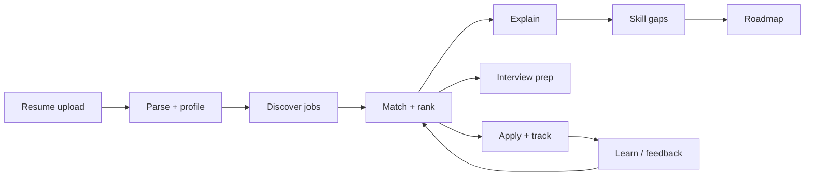

# Architecture

EMBEDHUNT AI is a layered, async Python backend with a Flutter client. The design
goal is an autonomous agent that turns a resume into a continuously-improving job
hunt, with every recommendation explained and every gap actionable.

## High-level flow



## Backend layers

```
app/
  api/            HTTP layer — versioned routers (api/v1/*)
  agent/          Autonomous copilot: planner, reasoner, decision engine, executor,
                  memory, opportunity finder, career coach
  recommendation/ Matching engine, ranking, explanation, skill-gap analysis
  job_sources/    Job discovery connectors (greenhouse, lever, remoteok) + aggregator
  services/       Business logic orchestrating repositories + engines
  repositories/   Data access over SQLAlchemy models
  models/         SQLAlchemy 2.0 ORM models (9 tables)
  schemas/        Pydantic request/response contracts
  auth/           JWT, password hashing (bcrypt), permissions
  middleware/     Correlation IDs, structured logging, error handling
  config/         Settings, logging, security, Prometheus metrics
  core/           App lifecycle (startup/shutdown), exceptions
  database/       Async engine, session, base
```

### Request lifecycle

1. **Middleware** assigns a correlation ID, logs the request, and wraps errors into
   a consistent JSON envelope.
2. **Router** (`api/v1/*`) validates input via Pydantic schemas and resolves
   dependencies (DB session, current user from JWT).
3. **Service** coordinates repositories and engines, enforcing business rules.
4. **Repository** performs async SQLAlchemy queries.
5. The response is serialized through a schema and returned.

### Recommendation engine

The engine scores each job against the candidate profile across weighted skill
categories, producing a `match_score`, a `match_tier`
(`auto_apply` > `strong` > `good` > `partial`), matched/missing skills, and a
human-readable explanation and recommendation. `run_live_matching` augments the
seed corpus with freshly discovered jobs from `job_sources`.

### Job discovery

`job_sources/` defines a `JobSource` abstraction and concrete connectors. The
`aggregator` fans out across sources, isolates per-source failures, and dedupes the
combined corpus. Connectors use only the standard library (`urllib`) and accept an
injectable `Fetcher`, which makes them fully testable without network access.

### Autonomous agent

`CareerCopilotAgent.run()` chains phases — scan, reason, plan, coach — and can run
in `live` mode to discover jobs on demand. The agent logs each phase, keeps memory,
and produces advice plus an auto-apply queue subject to user approval.

## Data model (9 tables)

`users`, `resumes`, `candidate_profiles`, `companies`, `job_recommendations`,
`applications`, `learning_roadmaps`, `interview_sessions`, `notifications`.

Schema is managed by Alembic (`migrations/`); `scripts/init_db.py` can create all
tables directly for local SQLite development.

## Mobile client

```
mobile/lib/
  config.dart        API base URL + timeouts (override via --dart-define)
  models/            User, Job, Dashboard — typed mirrors of the API contract
  services/          ApiClient (auth + 401 refresh), AuthService, CareerService
  providers/         AuthProvider, CareerProvider (ChangeNotifier state)
  screens/           splash, login, register, dashboard, recommendations, job detail
  widgets/           JobCard, ScoreBadge
  theme/             AppTheme design system
```

The client keeps JWTs in `flutter_secure_storage`, injects the bearer token, and
transparently refreshes once on a `401` before surfacing an error.

## Observability

- **Metrics**: `app/config/metrics.py` adds a Prometheus middleware
  (`embedhunt_http_requests_total`, latency histogram by method/route/status) and a
  `/metrics` endpoint, scraped by the config in `deployment/monitoring`.
- **Logging**: structured logs with correlation IDs via `structlog`.

## Scaling

- The API is stateless behind nginx; scale horizontally via the Kubernetes
  Deployment + HPA (`deployment/kubernetes`, 3→20 replicas at 70% CPU).
- Postgres and Redis are external dependencies; the app holds no local state.
- Job discovery isolates per-source failures so one slow board never blocks a scan.
